# DistriChat - Distributed Chat Application

## Overview

DistriChat is a distributed chat application built with Django that enables real-time messaging across multiple nodes. The system features a central server for user management and message routing, with distributed nodes handling chat rooms and real-time communication.

## 🏗️ DistriChat Architecture & Workflow

```mermaid
%%{init: {'theme':'default', 'themeVariables': { 'fontSize': '14px'}}}%%

flowchart TD
    %% ========== USERS & CLIENTS ==========
    subgraph Users["👥 Users & Clients"]
        U1[Web Browser<br/>User 1]
        U2[Web Browser<br/>User 2]
        U3[Web Browser<br/>User 3]
        U4[Web Browser<br/>User 4]
    end

    %% ========== LOAD BALANCER ==========
    LB[Load Balancer<br/>nginx]

    %% ========== CENTRAL SERVER ==========
    subgraph CentralServer["🏢 Central Server (Port 8000)"]
        CS_WEB[Django Web Layer]
        CS_WS[WebSocket Handler]
        CS_API[REST API]
        
        subgraph CS_Apps["Django Apps"]
            CS_Auth[Users App<br/>Authentication]
            CS_Chat[Chat App<br/>Room Management]
            CS_Nodes[Nodes App<br/>Node Management]
            CS_DB[(Central Database<br/>SQLite/PostgreSQL)]
        end
        
        CS_WEB --> CS_Apps
        CS_WS --> CS_Apps
        CS_API --> CS_Apps
    end

    %% ========== DISTRIBUTED NODES ==========
    subgraph Nodes["🌐 Distributed Chat Nodes"]
        subgraph Node1["🖥️ Node 1 (Port 8001)"]
            N1_WS[WebSocket Server]
            N1_Chat[Chat Consumers]
            N1_HB[Heartbeat Service]
            N1_DB[(Node 1 DB)]
        end
        
        subgraph Node2["🖥️ Node 2 (Port 8002)"]
            N2_WS[WebSocket Server]
            N2_Chat[Chat Consumers]
            N2_HB[Heartbeat Service]
            N2_DB[(Node 2 DB)]
        end
        
        subgraph Node3["🖥️ Node N (Port 800N)"]
            N3_WS[WebSocket Server]
            N3_Chat[Chat Consumers]
            N3_HB[Heartbeat Service]
            N3_DB[(Node N DB)]
        end
    end

    %% ========== INFRASTRUCTURE ==========
    subgraph Infrastructure["⚙️ Infrastructure Services"]
        Redis[Redis<br/>Channel Layer]
        Celery[Celery<br/>Background Tasks]
    end

    %% ========== CONNECTIONS ==========
    %% User to Load Balancer
    U1 --> LB
    U2 --> LB
    U3 --> LB
    U4 --> LB

    %% Load Balancer to Central Server
    LB --> CS_WEB
    LB --> CS_WS
    LB --> CS_API

    %% Central Server to Nodes (Management)
    CS_Nodes -.->|Node Registration| N1_HB
    CS_Nodes -.->|Node Registration| N2_HB
    CS_Nodes -.->|Node Registration| N3_HB

    %% Heartbeat connections
    N1_HB -.->|Heartbeat<br/>Every 30s| CS_Nodes
    N2_HB -.->|Heartbeat<br/>Every 30s| CS_Nodes
    N3_HB -.->|Heartbeat<br/>Every 30s| CS_Nodes

    %% WebSocket connections to Nodes
    U1 -->|WebSocket<br/>Room A| N1_WS
    U2 -->|WebSocket<br/>Room A| N1_WS
    U3 -->|WebSocket<br/>Room B| N2_WS
    U4 -->|WebSocket<br/>Room C| N3_WS

    %% Redis connections
    CS_WS --> Redis
    N1_WS --> Redis
    N2_WS --> Redis
    N3_WS --> Redis

    %% Celery connections
    CS_Chat --> Celery
    CS_Nodes --> Celery

    %% Database connections
    CS_Apps --> CS_DB
    N1_Chat --> N1_DB
    N2_Chat --> N2_DB
    N3_Chat --> N3_DB

    %% ========== STYLES ==========
    classDef user fill:#e1f5fe,stroke:#01579b,stroke-width:2px
    classDef central fill:#f3e5f5,stroke:#4a148c,stroke-width:3px
    classDef node fill:#e8f5e8,stroke:#1b5e20,stroke-width:2px
    classDef service fill:#fff3e0,stroke:#e65100,stroke-width:2px
    classDef database fill:#fce4ec,stroke:#880e4f,stroke-width:2px
    
    class U1,U2,U3,U4 user
    class CentralServer central
    class Node1,Node2,Node3 node
    class Redis,Celery,LB service
    class CS_DB,N1_DB,N2_DB,N3_DB database
```


## 🔄 Detailed Workflow Sequence


## 📊 Data Flow Architecture

```mermaid
%%{init: {'theme':'default', 'themeVariables': { 'fontSize': '13px'}}}%%

flowchart TD
    subgraph Frontend["🎨 Frontend Layer"]
        HTML[Django Templates<br/>HTML Pages]
        CSS[TailwindCSS<br/>Styling]
        JS[JavaScript<br/>WebSocket Client]
        AOS[AOS Animations]
    end

    subgraph Backend["🔧 Backend Layer"]
        subgraph Central["🏢 Central Server"]
            C_Views[View Controllers]
            C_Models[Data Models]
            C_Admin[Admin Interface]
            C_Auth[Authentication]
        end
        
        subgraph Nodes["🌐 Distributed Nodes"]
            N_Consumers[WebSocket Consumers]
            N_Services[Node Services]
            N_Heartbeat[Heartbeat Manager]
        end
    end

    subgraph Data["💾 Data Layer"]
        CentralDB[(Central DB<br/>Users/Nodes/Rooms)]
        Node1DB[(Node 1 DB<br/>Messages)]
        Node2DB[(Node 2 DB<br/>Messages)]
        RedisDB[(Redis<br/>Channel Layer)]
    end

    subgraph Network["🌍 Network Layer"]
        HTTP[HTTP/HTTPS<br/>REST API]
        WS[WebSocket<br/>Real-time Comm]
        HB[Heartbeat<br/>Health Monitoring]
    end

    %% Connections
    Frontend --> Backend
    Backend --> Data
    Backend --> Network
    
    Central --> Nodes
    Nodes --> RedisDB
    
    C_Models --> CentralDB
    N_Consumers --> Node1DB
    N_Consumers --> Node2DB
```



## Features

- **Distributed Architecture**: Multiple nodes for high availability and load distribution
- **Real-time Messaging**: WebSocket-based instant message delivery
- **User Authentication**: Secure user registration and login system
- **Room Management**: Create and join chat rooms across different nodes
- **Node Monitoring**: Real-time status monitoring of distributed nodes
- **Responsive Design**: Mobile-friendly interface with TailwindCSS
- **Modern UI**: Smooth animations with AOS library

## Technology Stack

### Backend
- **Django 5.1+**: Web framework
- **Django Channels**: WebSocket support for real-time features
- **Redis**: Channel layer for distributed WebSocket communication
- **SQLite/PostgreSQL**: Database (configurable)

### Frontend
- **Django Templates**: Server-side rendering
- **TailwindCSS**: Utility-first CSS framework
- **AOS (Animate On Scroll)**: Scroll animations
- **Vanilla JavaScript**: Client-side interactivity
- **WebSocket API**: Real-time communication

## Project Structure

```
districhat/
├── central_server      ## Main server-Manages nodes and sync them
│   ├── chat            # Main chat application
│   ├── districhat      # Project settings
│   ├── nodes           # Node management app
│   ├── static          # Static files (CSS, JS, images)
│   ├── templates       # HTML templates
│   └── users           # User management
├── node1               ## NODE 1
│   ├── chat            # Main chat application  
│   ├── districhat      # Project settings
│   ├── nodes           # Node management app
│   ├── static          # Static files (CSS, JS, images)
│   ├── templates       # HTML templates
│   └── users           # User management
└── node2               ## NODE 2
    ├── chat            # Main chat application
    ├── districhat      # Project settings
    ├── nodes           # Node management app
    ├── static          # Static files (CSS, JS, images)
    ├── templates       # HTML templates
    └── users           # User management
└── requirements.txt    # Python dependencies

```

## Installation

### Prerequisites
- Python 3.13+
- Redis server
- Virtual environment (recommended)
- channels
- channels_redis
- requests

### Setup Instructions

1. **Clone and setup the project**:
```bash
git clone https://github.com/skye-cyber/DistriChat.git
cd DistriChat
python -m venv venv
source venv/bin/activate  # On Windows: venv\Scripts\activate
```

2. **Install dependencies**:
```bash
pip install -r requirements.txt
```

3. **Configure**:
- Can be modified via settings for each node eg server configuration

```bash
TESTING = False
if TESTING:
    DATABASES = {
        "default": {
            "ENGINE": "django.db.backends.sqlite3",
            "NAME": BASE_DIR / "node2_db.sqlite3",
        }
    }
else:
    DATABASES = {
        "default": {
            "ENGINE": "django.db.backends.mysql",
            "NAME": "districhat_node2",
            "USER": "districhat_user",
            "PASSWORD": "districhat@PhantomJoker@15",
            "HOST": "localhost",
            "PORT": "3306",
        }
    }
```

4. **Run migrations**:
```bash
python manage.py migrate
```

5. **Create superuser**:
```bash
python manage.py createsuperuser
```

6. **Start Redis** (required for WebSockets):
```bash
# On Ubuntu/Debian
sudo systemctl start redis

# On macOS with Homebrew
brew services start redis

# On Windows
redis-server
```

7. **Run the development server**:

>> **Central server**
```bash
npm run start:main
```
or
```bash
python central_server/manage.py runserver 0.0.0.0:8001
```

>> **Node1 server**
```bash
npm run start:node1
```

>> **Node2 server**
```bash
npm run start:node2
```
## Configuration

### Environment Variables
Create a in settings.py for all nodes file update:

```env
DEBUG = True

ALLOWED_HOSTS = [
    "localhost",
    "127.0.0.1",
    "192.168.43.234",
    "0.0.0.0",
    "node1.chatserver.local",
]
```

### Database
The project supports multiple databases through Django's database configuration:
- SQLite (set as default for testing)
- MySQL (default db)
- PostgreSQL (recommended for production)

## Usage

### For Users
1. **Register**: Create a new account
2. **Login**: Access your dashboard
3. **Create/Join Rooms**: Start or join chat rooms
4. **Real-time Chat**: Send and receive messages instantly

### For Administrators
1. **Monitor Nodes**: View status of all distributed nodes
2. **Manage Rooms**: Oversee chat room creation and usage
3. **User Management**: Administer user accounts and permissions
4. **Approve** new node Registration

## Distributed Architecture

### Node Registration
1. Nodes register with the central server
2. Server maintains node health and load information
3. New chat rooms are assigned to the least loaded node - this keeps nodes within their capacities

### Message Flow
1. User sends message → Central server
2. Server routes message → Appropriate node
3. Node broadcasts message → All users in room

### 🔄 Real-time Message Flow


### Load Balancing
- Round-robin assignment of new rooms
- Dynamic load monitoring
- Automatic failover to healthy nodes

## API Endpoints

### WebSocket Endpoints
- `/ws/chat/{room_id}/` - Real-time chat communication

### HTTP Endpoints
- `/` - Homepage
- `/register/` - User registration
- `/login/` - User login
- `/chat/dashboard/` - User dashboard
- `/chat/{room_id}/` - Chat room
- `/nodes/dashboard` - Node management (admin)
- `/admin/` - Django admin site


### Code Style
This project uses:
- Black for code formatting
- Flake8 for linting
- isort for import sorting
- mccabe for code styling
- pycodestyle for code formating

### Adding New Features
1. Create feature branch
2. Implement changes
3. Add tests
4. Update documentation
5. Submit pull request

## Deployment

### 🚀 Deployment Architecture


### Production Setup
1. Set `DEBUG=False`
2. Configure production database
3. Set up Redis for channel layers
4. Use ASGI server (Daphne)
5. Configure static files serving
6. Set up SSL certificates

### Using Docker
```bash
docker-compose up -d
```


## Monitoring

### Health Checks
- Node status monitoring
- Database connection checks
- Redis connectivity verification
- WebSocket connection tracking

### Logging
Structured logging for:
- User activities
- Node communications
- Error tracking
- Performance metrics

## Contributing

1. Fork the repository
2. Create a feature branch
3. Make your changes
4. Add tests
5. Submit a pull request

## License

This program is free software: you can redistribute it and/or modify
    it under the terms of the GNU General Public License as published by
    the Free Software Foundation, either version 3 of the License, or
    (at your option) any later version.

    This program is distributed in the hope that it will be useful,
    but WITHOUT ANY WARRANTY; without even the implied warranty of
    MERCHANTABILITY or FITNESS FOR A PARTICULAR PURPOSE.  See the
    GNU General Public License for more details.

    You should have received a copy of the GNU General Public License
    along with this program.  If not, see <https://www.gnu.org/licenses/>.
    
  See the LICENSE file for more details. See the [LICENSE](LICENSE) file for details.

## Support

For support and questions:
- Create an issue on GitHub
- Check documentation
- Join our community chat

---

**DistriChat** - Powering distributed conversations across the globe! 🌐

---
